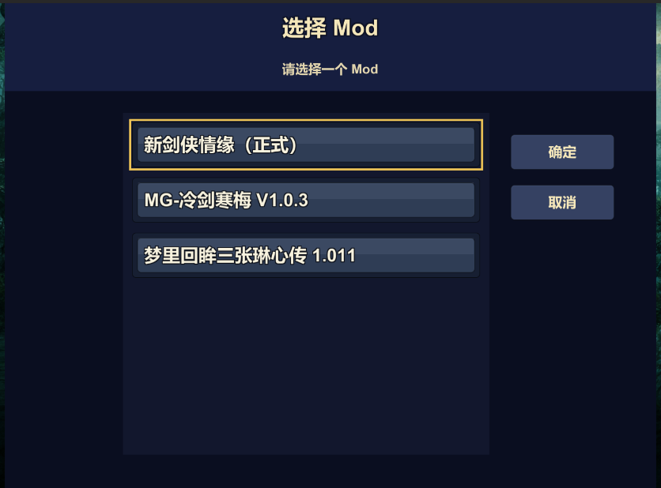
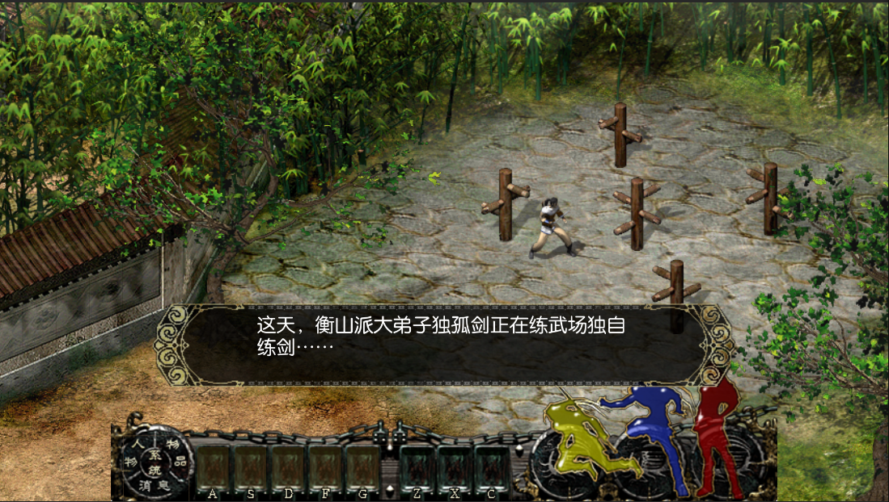
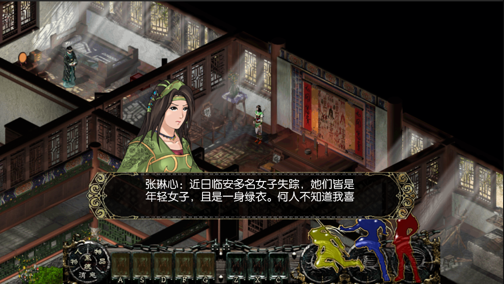

# 剑侠情缘 Mod Unity 6 工程

这是 `Jx_New_Mod` v1.0 的公开干净工程，基于 Unity 6、TEngine 与 YooAsset，为《新剑侠情缘》及其 Mod 提供彼此隔离、可扩展的现代运行框架。

> Git 仓库只包含程序代码、工程配置与启动工具，不包含原游戏或 Mod 的美术、音频、视频、地图、剧情脚本等资源。运行所需资源必须通过独立发布的 UnityPackage 获取。

> 测试进度说明：由于项目作者的时间与精力有限，目前尚未对正式版及两个 Mod 的全部主线、支线和结局完成逐项人工通关测试。如在游玩过程中发现遗漏或兼容问题，欢迎通过 [GitHub Issues](https://github.com/xiayu519/jxnew/issues) 反馈；也欢迎下载本工程自行排查、修复并分享改进。

## 当前内容分支

- **新剑侠情缘（正式）**：正式版内容分支，也是已经验证的基础运行分支。
- **MG-冷剑寒梅 V1.0.3**：修神天荐制作的新剑侠情缘 Mod。本工程在不改变正式版行为的前提下，为其补充刀剑引擎脚本兼容与独立资源加载能力。
- **梦里回眸三张琳心传 1.011**：围绕张琳心路线扩展剧情、支线、结局、武功与地图内容的 Mod。本工程保留其独立脚本和资源命名空间，并通过公共兼容层运行。

启动时选择哪个内容分支，就优先加载该分支自己的资源。正式版使用正式版资源及其共享资源；两个刀剑引擎 Mod 按“Mod 自有资源 → 新剑共享资源 → 刀剑 5.4.3 共享资源”的顺序查找，不会相互串包。兼容功能位于公共运行层，不按具体 Mod 名称写死，便于后续继续接入同类 Mod。

## 运行截图

## 目录结构

- `01-CleanProject`：可公开克隆的 Unity 源码工程。
- `docs`：资源包结构与校验说明。

## 下载

### Windows PC 体验包

Windows 体验包由于超过 GitHub 单文件 2 GiB 限制，拆分为三个 ZIP；三个文件全部必需。下载后将三个 ZIP 依次解压到同一个父目录，再运行 `Verify-Packages.bat`，检查通过后运行 `XinJianXia.exe`。

- [Windows PC 体验包 1/3](https://github.com/xiayu519/jxnew/releases/download/windows-il2cpp-20260830/JxNew-Windows-x64-IL2CPP-20260830-1of3.zip)
- [Windows PC 体验包 2/3](https://github.com/xiayu519/jxnew/releases/download/windows-il2cpp-20260830/JxNew-Windows-x64-IL2CPP-20260830-2of3.zip)
- [Windows PC 体验包 3/3](https://github.com/xiayu519/jxnew/releases/download/windows-il2cpp-20260830/JxNew-Windows-x64-IL2CPP-20260830-3of3.zip)
- [SHA-256 校验文件](https://github.com/xiayu519/jxnew/releases/download/windows-il2cpp-20260830/JxNew-Windows-x64-IL2CPP-20260830-SHA256.txt)

三个分卷共同组成完整产品，包含新剑侠情缘正式版、`MG-冷剑寒梅 V1.0.3`、`梦里回眸三张琴心传 1.011` 以及全部必需的共享资源，不能只下载其中一个分卷。

### UnityPackage 资源包

- [UnityPackage 资源包](https://github.com/xiayu519/jxnew/releases/download/resources-20260828/JxNewResources-20260828-BaiduNetdisk.txt)

## 开发环境

- Unity `6000.5.4f1`
- Windows 10/11
- YooAsset `EditorSimulateMode`

## 首次运行

1. 克隆本仓库。
2. 使用 Unity Hub 打开 `01-CleanProject/UnityProject`。
3. 完整导入单独下载的 `JxNewResources-20260828.unitypackage`。
4. 等待 Unity 完成资源导入与脚本编译。
5. 双击 `01-CleanProject/SetupResources.bat`。
6. 确认窗口显示 `SimulationManifest=Refreshed` 和 `BundleBuild=Skipped`。
7. 打开 `Assets/Scenes/main.unity`，点击 Play。
8. 在启动选择界面选择要运行的正式版或 Mod。

资源包内部仍使用五个彼此隔离的 YooAsset Package：

- `JxMod_XinJianXia`
- `JxShared_XinJianXiaBase`
- `JxShared_DaoJian543Base`
- `JxMod_LengJianHanMei`
- `JxMod_MengLiHuiMou`

## 致谢

衷心感谢两部 Mod 的原作者与参与制作人员，正是他们多年来对剧情、脚本、地图、界面、人物模型与工具链的探索，才使这些内容能够在新的运行环境中继续被体验：

- **《冷剑寒梅》**：Mod 制作，修神天荐。
- **《梦里回眸三张琳心传》**：脚本编写，梦吧、teaqinpeng；剧本改编，teaqinpeng；游戏界面，怡惜轩；新地图，nkpoj、greengrd；新人物模型，greengrd、nkpoj、Min、fbicia911、Lzwnei、悠长假期、生还者；新武功图标，梦吧。
- 感谢小试刀剑、Min 对刀剑引擎与相关工具的研发，也感谢原 Mod 说明中列出的所有研究者、测试者和社区成员。

同时感谢以下开源项目与社区：

- [TEngine](https://github.com/Alex-Rachel/TEngine)：本项目使用的 Unity 开发框架。
- [JxqyHD](https://github.com/mapic91/JxqyHD)：为原作逻辑与资源组织研究提供了重要参考。
- [miu2d](https://github.com/luckyyyyy/miu2d)：为 Mod 模板和兼容结构提供了参考。
- 剑侠情缘 MOD 群（群号：`253396454`）：感谢群友们长期以来的交流、资料分享与研究支持。

最后，特别感谢西山居创造《剑侠情缘》单机版系列。

## 版权说明

本项目仅用于学习、研究与技术交流。《剑侠情缘》系列及相关名称、角色、美术、音乐和其他原始内容的权利归其合法权利人所有；各 Mod 的原创内容权利归相应作者所有。本项目与西山居及相关权利人不存在官方隶属或授权关系，请勿用于商业用途。
